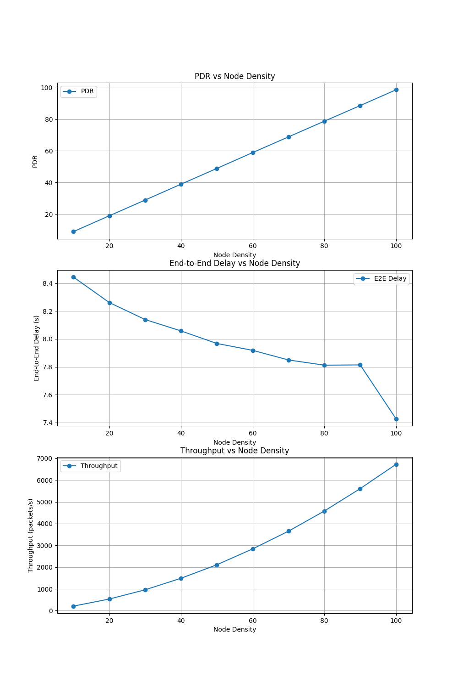
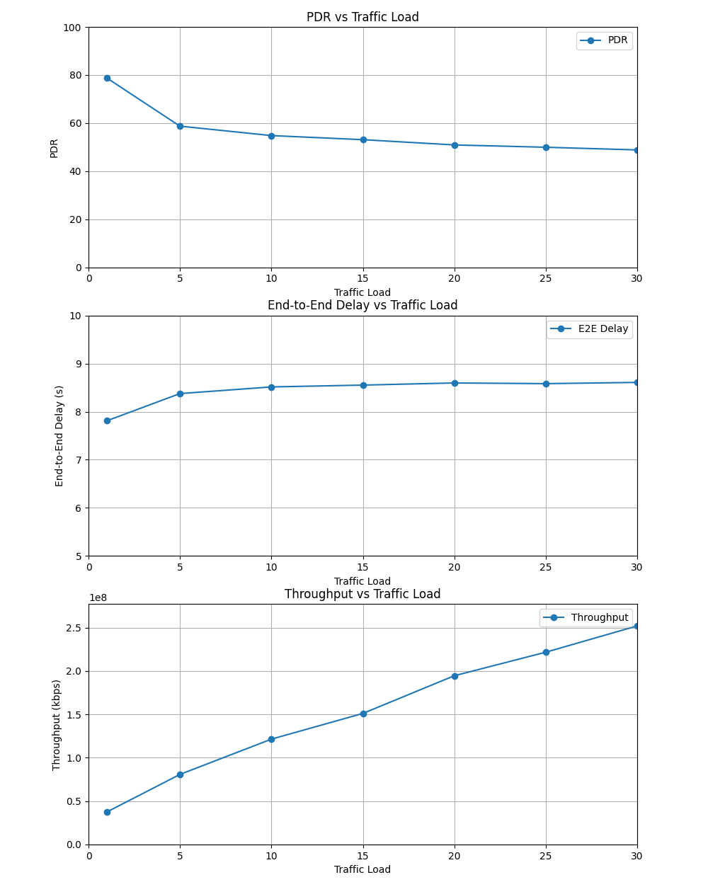

# Wireless Network Performance Analysis with ns-3

This repository contains the results and source code for analyzing wireless network performance using ns-3. Two primary experiments are included:

1. **Node Density Analysis**: Examining the impact of varying node densities on network metrics such as Packet Delivery Ratio (PDR), end-to-end delay, and throughput.
2. **Traffic Load Analysis**: Studying how different traffic loads affect the same performance metrics.

## Repository Structure
```
.
├── node_density
│   ├── Task1.cc.cc               # ns-3 simulation script for node density analysis
│   ├── Task1.py.py               # Python script for processing trace files
│   ├── metrics_vs_node_density1.png # Graph showing results of node density experiment
│   ├── test1.sh                  # Shell script to run the node density experiment
├── traffic_load
│   ├── Task2.cc.cc               # ns-3 simulation script for traffic load analysis
│   ├── Task2.py.py               # Python script for processing trace files
│   ├── metrics_vs_traffic_load2.png # Graph showing results of traffic load experiment
│   ├── test2.sh                  # Shell script to run the traffic load experiment
├── LICENSE
├── README.md                     # This README file
```

## Prerequisites

- **ns-3**: Ensure that ns-3 is installed and properly configured on your system. Follow the official [ns-3 installation guide](https://www.nsnam.org/wiki/Installation) for instructions.
- **Python**: Required to run the result processing scripts (`Task1.py.py` and `Task2.py.py`).

## Task 1: Node Density Analysis

**Objective**: Analyze the impact of varying node densities (10 to 100) on network performance metrics.

### Methodology
- Networks with node densities ranging from 10 to 100 were created.
- Each density was tested ten times with seeds from 1 to 10 to ensure randomness.
- A Python script processed trace files to compute the following metrics:
  - **PDR**: Number of received packets divided by the number of sent packets.
  - **End-to-End Delay**: Averaged over the times of packet transmission and reception.
  - **Throughput**: Total received packets divided by the simulation duration.

### Results
The results indicate:
- **Higher Node Densities** improve PDR and throughput while reducing end-to-end delay.
- Example metrics:
  - At 10 nodes: PDR ~9%, Delay ~8.44s, Throughput ~208 kbps.
  - At 100 nodes: PDR ~99%, Delay ~7.43s, Throughput ~6730 kbps.



## Task 2: Traffic Load Analysis

**Objective**: Evaluate the effect of varying traffic loads (1 to 30 source-destination pairs) on network performance metrics in an 80-node network.

### Methodology
- Traffic loads were varied from 1 to 30 pairs.
- Each scenario was tested ten times with different seeds for reliability.
- A Python script processed trace files to compute:
  - **PDR**: Number of received packets divided by the number of sent packets.
  - **End-to-End Delay**: Averaged over the times of packet transmission and reception.
  - **Throughput**: Total received packets divided by the simulation duration.

### Results
The results show:
- **Higher Traffic Loads** decrease PDR and slightly increase delay but significantly improve throughput.
- Example metrics:
  - At traffic load 1: PDR ~78.77%, Delay ~7.81s, Throughput ~37489.65 kbps.
  - At traffic load 30: PDR ~48.84%, Delay ~8.61s, Throughput ~251995.99 kbps.



## License
This project is licensed under the terms specified in the `LICENSE` file.

## Contact
For questions or feedback, please open an issue or contact the repository owner.

